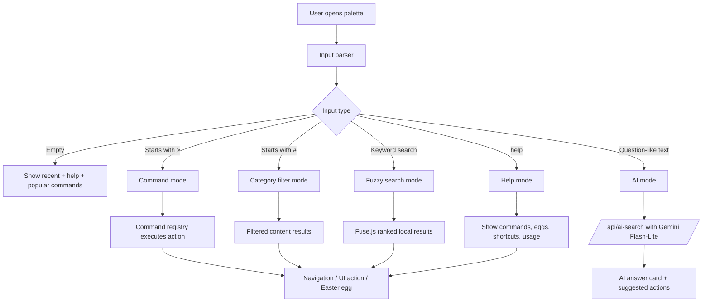

# SubhashOS Search + AI + Easter Eggs — Master Implementation Prompt

## Objective
Implement a production-ready **Search / Command Palette** in the existing SubhashOS portfolio using the current Next.js App Router codebase. The feature must feel native to the OS-style UI, support keyboard-first navigation, fuzzy search, command execution, AI Q&A using **Gemini Flash-Lite on the free tier**, and a layered Easter egg system that works both inside the palette and across the main portfolio UI. [web:74][web:76][web:79]

## Output Requirements
Build the feature directly into the current project instead of creating a separate app. Preserve the existing dark neon desktop aesthetic, terminal language, widgets, and boot sequence. The palette must be fast, accessible, reusable, and architected so future commands, achievements, and content sources can be added with minimal refactoring. [web:76][web:84]

## Product Vision
The command palette is the **Spotlight + Terminal + Assistant** layer of SubhashOS. It should allow visitors to search projects, skills, research, resume data, and navigation targets; execute terminal-style commands; trigger cinematic Easter eggs; ask basic natural-language questions about Subhash; and open a help view that documents every available command, mode, and hidden interaction.

---

## Master Prompt

You are implementing a command-palette system inside an existing **Next.js App Router + TypeScript + Tailwind** portfolio called **SubhashOS**. Do not redesign the site from scratch. Extend the current architecture cleanly and idiomatically.

### Core Goals
1. Add a **taskbar search bar** and **full command palette overlay** opened by click, `Ctrl+K`, or `Cmd+K`. [web:76][web:84]
2. Support **four input modes**:
   - **Search mode** for fuzzy content search.
   - **Command mode** for terminal-like commands starting with `>` or exact command matches.
   - **AI mode** for natural-language questions.
   - **Help mode** for listing commands, categories, Easter eggs, and keyboard shortcuts.
3. Use **Gemini Flash-Lite free tier** through a secure server route for AI answers about Subhash based on a curated local knowledge base. Use a compact prompt and grounding data from existing portfolio content. [web:74][web:75]
4. Integrate all approved **Easter eggs** into both the palette and main portfolio triggers where specified.
5. Keep implementation modular: search indexing, command registry, Easter egg engine, achievements, AI route, and palette UI should be isolated.
6. Preserve the existing **SubhashOS tone**: terminal-like, witty, polished, slightly playful, but still professional.

### UX Principles
- The search bar in the taskbar is the visible affordance; the overlay is the real interaction surface.
- The palette must feel like a **system shell**, not a generic modal.
- Keyboard interaction is first-class: arrows to navigate, Enter to run, Escape to close, Tab to autocomplete where appropriate.
- Search results should be grouped by type: Navigation, Projects, Skills, Research, Resume, Commands, Easter Eggs, AI Suggestions.
- Search should be instant on the client for local data.
- AI calls should happen only for real questions, not for short keyword queries.
- Every command and Easter egg should also be discoverable via the **help** command.

---

## Full Search Flow Design



### Input Routing Rules
- If input is empty, show: recent actions, quick navigation, `help`, `projects`, `resume`, `contact`, and featured Easter eggs.
- If input starts with `>`, route to command mode.
- If input starts with `#`, route to tag/category filtering such as `#projects`, `#skills`, `#ai`, `#devops`.
- If input matches a known command exactly, execute or preview that command.
- If input looks like a question (`who`, `what`, `how`, `tell me`, `can`, `does`, `?`, more than 4 natural words), route to AI mode.
- Otherwise run fuzzy search over local indexed content.
- If input is `help`, `?`, or `commands`, open Help mode.

### AI Search Scope
The AI assistant should answer **basic portfolio questions only**, such as:
- Who is Subhash?
- What are his main skills?
- What projects has he built?
- Is he available for work?
- What stack does he use for AI or DevOps?
- Where can I contact him?

The assistant must refuse or redirect non-portfolio topics, saying it only knows SubhashOS portfolio content.

---

## Functional Table

| Function / Feature | What It Does | Primary Tools | Implementation Instructions |
|---|---|---|---|
| Taskbar Search Entry | Adds visible `Search anything...` field in `Taskbar.tsx`; opens palette on click and supports `Ctrl+K` / `Cmd+K` | `cmdk` or `shadcn/ui Command` on top of `cmdk`, Tailwind, existing `Taskbar.tsx` [web:76][web:84] | Add compact search pill in taskbar center; bind global `keydown` listener in a dedicated hook; keep open state in Zustand store or local state lifted into shell layer |
| Palette Overlay | Full-screen / centered command palette with grouped results, keyboard navigation, animated open/close | `cmdk`, GSAP or Framer Motion / motion.dev for overlay animation [web:78][web:84] | Create `CommandPalette.tsx`; use portal; animate opacity + scale + blur; keep dark glassmorphism and monospace styling |
| Fuzzy Search | Searches projects, skills, research, resume sections, routes, commands, Easter eggs | Fuse.js, local normalized index | Build `searchIndex.ts` from `src/data/*`; include title, description, tags, route, section id, type, aliases; preload client-side |
| Command Registry | Maps command strings to actions, preview text, aliases, categories | TypeScript registry object, app router navigation, Zustand store | Create `commandRegistry.ts`; each command has `id`, `label`, `aliases`, `type`, `run()`, `keywords`, `help`, `dangerLevel`, `visibleInHelp` |
| Help Command | Shows all commands, hidden-but-discoverable eggs, keyboard shortcuts, categories, syntax examples | `cmdk`, command metadata, tabs / grouped sections | Support `help`, `?`, `commands`, `shortcuts`, `eggs`; render sections: Navigation, Utility, Media, AI, Easter Eggs, Shortcuts, Hidden Triggers |
| AI Q&A | Answers basic questions about Subhash using Gemini Flash-Lite free tier with local portfolio grounding | Gemini API, Next.js route handler, `@google/genai` or current Google SDK, server-side prompt [web:74][web:75][web:79] | Add `/api/ai-search/route.ts`; send system prompt + compact knowledge context from local JSON; rate-limit and sanitize; return markdown-lite plain text |
| AI Suggestion Chips | Shows prompts like “Who is Subhash?”, “What projects should I see?”, “How to contact him?” | React UI only | When in AI mode and input is empty/question-like, render clickable suggestion chips beneath input |
| Navigation Actions | Jump to Home / Projects / Research / Resume / Contact or scroll to sections | Next.js router, DOM section refs, GSAP scrollTo if needed | Commands: `home`, `projects`, `research`, `resume`, `contact`, `goto home`, `open resume`, etc. |
| Result Grouping | Separates results into Projects / Skills / Research / Resume / Commands / Easter Eggs / AI | `cmdk` groups | Add deterministic ordering and icons per type; keyboard enter triggers top result |
| Empty State | Shows onboarding: help, recent actions, featured commands, `Ask Subhash` hints | React + localStorage for recents | Store recent selections locally; display 5 latest plus curated featured commands |
| Command Preview | Shows description / effect before running dangerous or cinematic commands | Side panel or footer hint area | For commands like `satella` or `return-by-death`, preview “cinematic Easter egg” before Enter |
| Command History | Lets users move through previously typed palette inputs | local state / localStorage | Arrow-up history optional in command mode; keep last 10 values |
| Achievement Engine | Unlocks and persists Easter egg achievements | localStorage, TypeScript helpers, optional toast animation | Create `achievementStore.ts`; unlock on trigger; expose hidden `achievements` command |
| Toast / System Notices | OS-style notifications for unlocks, AI status, command completion | GSAP or Framer Motion | Create `SystemToast.tsx`; use top-right stack with glowing purple border |
| Help Index for Eggs | Lists all visible Easter eggs and hints for rare ones | command metadata + egg metadata | Add visibility levels: public, hinted, secret; `help eggs` shows public + hinted only |
| Accessibility | Keyboard navigation, focus trap, aria labels, reduced-motion fallback | `cmdk`, React Aria patterns, prefers-reduced-motion | Trap focus when palette opens; provide alt text and disable heavy cinematic effects if reduced motion is enabled |
| Analytics-ready Logging | Optional internal event logging for command usage and AI calls | lightweight utility | Add `trackPaletteEvent()` helper for later analytics; no external dependency needed now |

---

## Easter Eggs Table

| Easter Egg / Command | Trigger Surface | What It Does | Tools | Implementation Instructions |
|---|---|---|---|---|
| `noir` / `spidernoir` | Palette + optional portrait trigger | Turns whole site black & white for ~30s with grain, vignette, rain, smoke, projector flicker, noir quotes, `Earth-90214` badge | GSAP, Canvas API, CSS overlays, Mo.js | Add `activateNoirMode()` in `easterEggEngine.ts`; use CSS filters on root shell, canvas rain overlay, quote rotator, timed restore |
| `binks` / `binkssake` | Palette + optional album-art trigger | Plays Binks’ Sake in hidden global audio layer, separate from music widget; subtle pirate ship sails in background; floating messages appear | Native `Audio`, GSAP, Anime.js | Keep independent audio element in engine; do not mutate `MusicPlayer`; mount transient ship overlay and lyric floats |
| `return-by-death` / `rbd` | Palette + optional page-typed trigger | Freezes animations, pulses dark violet glow, glitches panels, shows title, rewinds boot timeline, replays boot, increments attempt counter | GSAP `globalTimeline`, stored master boot timeline, Anime.js for glitch | Ensure `BootAnimation.tsx` registers master GSAP timeline globally; implement `activateReturnByDeath()` with pause, reverse, replay, and localStorage counter |
| `satella` / `i can return by death` | Palette + optional rare key combo | Darkens entire UI, purple shadow spread, hides most panels, draws shadow hands, shows system modal, then opens cinematic YouTube embed overlay | GSAP, SVG animation, YouTube iframe API, Mo.js | Build cinematic overlay component + shadow-hands SVG; start audio first, show modal, then iframe; restore on close |
| `witch factor` combo | Palette | Unlocks achievement if `satella` followed by `rbd` within 60s | localStorage, GSAP toast | Timestamp combo detection in engine; toast + achievement persistence |
| `laugh tale` | Palette | Terminal message then custom confetti using GitHub/Docker/Linux icon shapes | canvas-confetti, GSAP TextPlugin | Add icon shape paths and trigger from command registry |
| `gear5` | Palette + optional logo clicks | White flash, bounce/wobble UI, cloud particles, custom cursor, laugh cue | Anime.js, Mo.js, GSAP | Keep effect short and playful; auto-reset after 15s |
| `sudo rm -rf /` | Palette | Fake destructive glitch and restore with witty terminal response | Anime.js, GSAP | Stagger panel collapse, then restore; no real state loss |
| `vim` | Palette | Converts palette into fake Vim session until `:q!` / `:wq` | local parser, GSAP, Anime.js | Special palette sub-view with cursor blink and fake command parser |
| `ping subhash` | Palette | Fake low-latency ping output | GSAP TextPlugin / timed line prints | Render terminal lines sequentially |
| `ls -la secrets/` | Palette | Fake secrets directory listing | Anime.js stagger | Use playful filenames, keep tasteful |
| `help me` | Palette | Witty support response then navigates to Contact | GSAP, router/scroll | Show spinner, then transition to contact route or section |
| `help` / `?` / `commands` | Palette | Lists every visible command, category, shortcut, and hintable Easter egg | `cmdk`, command metadata | Make this first-class, searchable, and grouped |
| Konami code | Main portfolio | Confetti + badge + terminal respect message | tinykeys or custom key sequence, canvas-confetti | Add shell-level listener in provider |
| Screensaver idle mode | Main portfolio | DVD-style bouncing SubhashOS logo after 60s idle | GSAP ticker | Mount in shell layer; dismiss on interaction |
| DevTools console art | Main portfolio | Styled ASCII art + GitHub/hire message in browser console | Vanilla console + DevTools heuristic | Safe optional enhancement |

---

## AI API Design — Gemini Flash-Lite Free Tier

Use **Gemini Flash-Lite** via a secure App Router API route with an environment variable for the API key. Google documents a free tier for the Gemini Developer API, and Gemini Flash-Lite is positioned as a low-cost / high-throughput model family suitable for lightweight assistant tasks. [web:71][web:74][web:73]

### API Rules
- Use server-side route only; never expose the API key in the client.
- Restrict the model to **portfolio Q&A**.
- Ground every response using local project/resume/research/skills data.
- Keep answers concise, factual, and in first person or portfolio voice.
- Refuse unrelated questions politely.
- Limit output length to avoid cost and latency.
- Add basic per-IP or session throttling if possible.

### Suggested API Route Behavior
**Route:** `src/app/api/ai-search/route.ts`

**Request body:**
```ts
{ query: string }
```

**Server flow:**
1. Validate and trim the query.
2. Build a compact grounding context from local datasets.
3. Send system instruction + user query to Gemini Flash-Lite.
4. Return plain JSON with `answer`, `suggestions`, and optional `sources`.
5. On errors, return a friendly fallback.

### Suggested System Prompt for Gemini
```text
You are SubhashOS Assistant embedded inside Subhash R's portfolio website.
Answer only using the provided portfolio context.
Be concise, accurate, developer-friendly, and slightly witty.
If the question is outside Subhash R's portfolio, say you only answer portfolio-related questions.
Prefer first-person voice when describing Subhash, but do not invent facts.
Keep answers under 120 words.
```

### Suggested Knowledge Sources
Build grounding text from:
- `src/data/projects.ts`
- `src/data/projectBank.ts`
- `src/data/skills.ts`
- `src/data/research.ts`
- `src/data/resume.ts`

---

## Command Inventory to Support

### Navigation
- `home`
- `projects`
- `research`
- `resume`
- `contact`
- `goto home`
- `open resume`
- `download resume`

### Filters / Search Helpers
- `#projects`
- `#skills`
- `#research`
- `#resume`
- `#ai`
- `#devops`
- `#cloud`
- `#ml`

### Utility
- `help`
- `?`
- `commands`
- `shortcuts`
- `eggs`
- `achievements`
- `clear`

### Media / Fun
- `play`
- `pause`
- `next`
- `binks`
- `gear5`

### System / Terminal Flavor
- `whoami`
- `cd /projects`
- `cd /research`
- `cd /resume`
- `ls`
- `cat about.txt`
- `ping subhash`
- `vim`
- `sudo rm -rf /`
- `ls -la secrets/`

### Cinematic Easter Eggs
- `noir`
- `spidernoir`
- `return-by-death`
- `rbd`
- `satella`
- `i can return by death`
- `laugh tale`

---

## Implementation Notes by Existing Codebase Area

### Shell Layer
Modify or extend:
- `src/components/shell/Taskbar.tsx`
- `src/components/shell/SystemTray.tsx`
- `src/components/shell/PageTransition.tsx`
- `src/components/shell/BottomDock.tsx`

Add the search trigger to the taskbar and mount the palette provider at the shell/app level so it is available globally.

### Boot / Animation Layer
Modify:
- `src/components/boot/BootAnimation.tsx`
- `src/lib/animations.ts`
- `src/lib/gsap.ts`

Refactor boot animations into a reusable master GSAP timeline so `return-by-death` can reverse and replay it cleanly.

### Data Layer
Reuse and normalize:
- `src/data/projectBank.ts`
- `src/data/projects.ts`
- `src/data/research.ts`
- `src/data/resume.ts`
- `src/data/skills.ts`

Create a local search index adapter layer instead of querying UI components directly.

### Store / Hooks Layer
Extend:
- `src/store/app.ts`
- `src/hooks/*`

Add palette state, active mode, current query, recent actions, command history, reduced-motion-aware flags, and achievement state hooks.

---

## Recommended New Files

| File | Purpose |
|---|---|
| `src/components/search/CommandPalette.tsx` | Main overlay UI |
| `src/components/search/SearchBarTrigger.tsx` | Taskbar search pill |
| `src/components/search/PaletteResults.tsx` | Grouped results renderer |
| `src/components/search/PaletteHelpView.tsx` | Help command UI |
| `src/components/search/PaletteAIResponse.tsx` | AI answer card |
| `src/components/search/PalettePreview.tsx` | Footer or side preview for selected command |
| `src/components/search/providers/PaletteProvider.tsx` | Global provider and listeners |
| `src/components/search/providers/EasterEggProvider.tsx` | Overlay mounts, audio, effects, achievement triggers |
| `src/components/search/effects/NoirOverlay.tsx` | Noir mode visuals |
| `src/components/search/effects/BinksOverlay.tsx` | Pirate ship + floating messages |
| `src/components/search/effects/ReturnByDeathOverlay.tsx` | Rewind title and glow layer |
| `src/components/search/effects/SatellaOverlay.tsx` | Shadow hands + modal + iframe |
| `src/components/search/effects/ScreensaverOverlay.tsx` | Idle screensaver |
| `src/components/search/effects/SystemToast.tsx` | Notifications / achievement toasts |
| `src/lib/search/searchIndex.ts` | Normalized searchable data |
| `src/lib/search/fuse.ts` | Fuse.js instance and ranking helpers |
| `src/lib/search/inputRouter.ts` | Detect mode and route input |
| `src/lib/search/commandRegistry.ts` | All commands + metadata |
| `src/lib/search/easterEggRegistry.ts` | Easter egg metadata |
| `src/lib/search/easterEggEngine.ts` | Trigger orchestration |
| `src/lib/search/helpIndex.ts` | Help-mode grouped data |
| `src/lib/search/aiContext.ts` | Local portfolio grounding text builder |
| `src/lib/search/types.ts` | Shared search/command types |
| `src/hooks/useCommandPalette.ts` | Palette state hook |
| `src/hooks/useKonamiCode.ts` | Konami detector |
| `src/hooks/useIdleScreensaver.ts` | Idle timer hook |
| `src/app/api/ai-search/route.ts` | Gemini Flash-Lite server route |
| `public/audio/easter-eggs/binks.mp3` | Binks Sake hidden audio |
| `public/audio/easter-eggs/heartbeat.mp3` | RBD heartbeat |
| `public/images/easter-eggs/` | ship, badges, optional overlays |

---

## Environment Variables

```bash
GEMINI_API_KEY=your_key_here
GEMINI_MODEL=gemini-2.5-flash-lite
```

If the exact latest Lite identifier changes, keep the model configurable via env and default to the current Flash-Lite variant documented in Gemini model docs. [web:73][web:75]

---

## Packages to Add

```bash
npm install cmdk fuse.js @google/genai gsap animejs canvas-confetti tinykeys
```

Optional only if needed:
```bash
npm install mo-js framer-motion
```

Use **GSAP** as the primary animation engine because the project already has GSAP utilities and the rewind effect depends on timeline control and reverse behavior. GSAP documents timeline control and global timelines, which directly support the `return-by-death` effect. [web:42][web:57][web:68]

---

## Engineering Constraints
- Do not break existing widgets, routes, or boot sequence.
- Keep the music widget isolated from hidden Easter egg audio.
- All cinematic overlays must clean up DOM nodes, timers, and audio on close.
- Respect `prefers-reduced-motion`; provide toned-down fallbacks.
- Keep commands data-driven through registries, not giant conditional chains.
- Avoid hardcoding content in components when it belongs in `src/data` or registry files.
- Make palette results and help content searchable.

---

## Done Criteria
The implementation is complete when:
1. Clicking the taskbar search or pressing `Cmd/Ctrl+K` opens the palette.
2. Fuzzy search returns grouped results from portfolio data.
3. `help` lists commands, shortcuts, categories, and Easter eggs.
4. Basic AI questions work through Gemini Flash-Lite free tier route.
5. All approved Easter eggs trigger correctly and cleanly.
6. `return-by-death` rewinds the boot timeline and replays it.
7. Achievements persist in localStorage.
8. The feature matches the existing SubhashOS visual language.

---

## New Project Structure

```text
subhashos/
├── public/
│   ├── audio/
│   │   ├── nee_kavithaigala.mp3
│   │   ├── pavazha_malli_unplugged.mp3
│   │   ├── pavazha_malli.mp3
│   │   ├── un-vizhigalli.mp3
│   │   ├── vizhi.mp3
│   │   └── easter-eggs/
│   │       ├── binks.mp3
│   │       └── heartbeat.mp3
│   ├── fonts/
│   │   ├── GeistMono.woff2
│   │   └── JetBrainsMono.woff2
│   ├── images/
│   │   ├── covers/
│   │   ├── easter-eggs/
│   │   │   ├── pirate-ship.svg
│   │   │   ├── achievement-badges/
│   │   │   └── overlays/
│   │   ├── album-cover.jpg
│   │   └── profile.png
│   └── favicon.ico
├── src/
│   ├── app/
│   │   ├── api/
│   │   │   ├── export-pdf/
│   │   │   │   └── route.ts
│   │   │   └── ai-search/
│   │   │       └── route.ts
│   │   ├── contact/
│   │   │   └── page.tsx
│   │   ├── projects/
│   │   │   └── page.tsx
│   │   ├── research/
│   │   │   └── page.tsx
│   │   ├── resume/
│   │   │   └── page.tsx
│   │   ├── layout.tsx
│   │   └── page.tsx
│   ├── components/
│   │   ├── boot/
│   │   │   ├── BootAnimation.tsx
│   │   │   └── BootGate.tsx
│   │   ├── contact/
│   │   ├── home/
│   │   ├── projects/
│   │   ├── research/
│   │   ├── resume/
│   │   ├── search/
│   │   │   ├── CommandPalette.tsx
│   │   │   ├── SearchBarTrigger.tsx
│   │   │   ├── PaletteResults.tsx
│   │   │   ├── PaletteHelpView.tsx
│   │   │   ├── PaletteAIResponse.tsx
│   │   │   ├── PalettePreview.tsx
│   │   │   ├── providers/
│   │   │   │   ├── PaletteProvider.tsx
│   │   │   │   └── EasterEggProvider.tsx
│   │   │   └── effects/
│   │   │       ├── NoirOverlay.tsx
│   │   │       ├── BinksOverlay.tsx
│   │   │       ├── ReturnByDeathOverlay.tsx
│   │   │       ├── SatellaOverlay.tsx
│   │   │       ├── ScreensaverOverlay.tsx
│   │   │       └── SystemToast.tsx
│   │   ├── shell/
│   │   │   ├── BottomDock.tsx
│   │   │   ├── PageTransition.tsx
│   │   │   ├── SystemTray.tsx
│   │   │   ├── Taskbar.tsx
│   │   │   └── WorkspaceLabel.tsx
│   │   ├── ui/
│   │   └── widgets/
│   ├── data/
│   │   ├── projectBank.ts
│   │   ├── projects.ts
│   │   ├── research.ts
│   │   ├── resume.ts
│   │   └── skills.ts
│   ├── hooks/
│   │   ├── useBattery.ts
│   │   ├── useBootComplete.ts
│   │   ├── useCommandPalette.ts
│   │   ├── useExportPDF.ts
│   │   ├── useIdleScreensaver.ts
│   │   ├── useKonamiCode.ts
│   │   ├── useLiveClock.ts
│   │   ├── useMusicPlayer.ts
│   │   └── usePageTransition.ts
│   ├── lib/
│   │   ├── animations.ts
│   │   ├── atsScorer.ts
│   │   ├── constants.ts
│   │   ├── generateLatex.ts
│   │   ├── gsap.ts
│   │   ├── resumeTemplate.ts
│   │   └── search/
│   │       ├── aiContext.ts
│   │       ├── commandRegistry.ts
│   │       ├── easterEggEngine.ts
│   │       ├── easterEggRegistry.ts
│   │       ├── fuse.ts
│   │       ├── helpIndex.ts
│   │       ├── inputRouter.ts
│   │       ├── searchIndex.ts
│   │       └── types.ts
│   ├── store/
│   │   └── app.ts
│   └── styles/
│       ├── animations.css
│       ├── fonts.css
│       ├── globals.css
│       └── search-effects.css
├── SubhashOS_Search_Master_Prompt.md
└── SubhashOS_Updated_Project_Structure_After_Search_fnc.md
```
